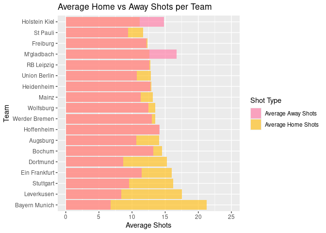
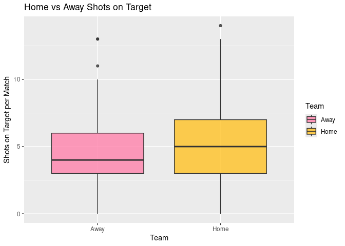
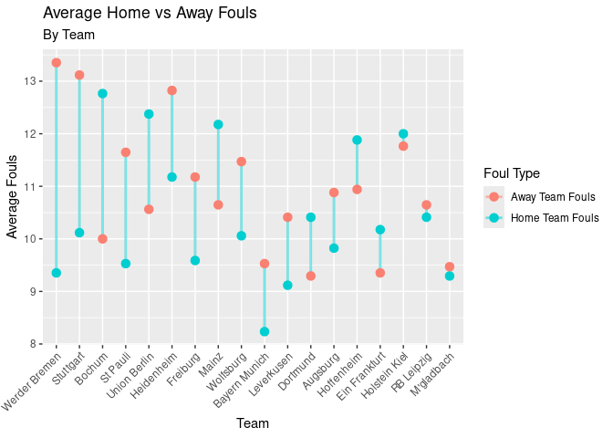

Project proposal
================
Lauren, Maeve, Annika

``` r
library(tidyverse)
library(broom)
season <- read_csv("/cloud/project/data/season.csv")
```

## 1. Introduction

The research question we’re exploring is how does playing at home versus
away impact team performance, as measured by average shots taken, shots
on target, and fouls received?

In this project, we are using data from the Football Datasets GitHub
Repository. This dataset provides detailed match statistics for all
Bundesliga games in the 2024-2025 season that is taken from the Football
Data UK Co website. Each row represents a single match, with information
on both the home and away teams, goals scored, shot taken, scores
throughout the game, fouls, etc. See README for full variables and
names.

## 2. Data

``` r
# dim(season)
```

``` r
season <- read_csv("../data/season.csv")
```

    ## Rows: 306 Columns: 22
    ## ── Column specification ────────────────────────────────────────────────────────
    ## Delimiter: ","
    ## chr  (5): Date, HomeTeam, AwayTeam, FTR, HTR
    ## dbl (16): FTHG, FTAG, HTHG, HTAG, HS, AS, HST, AST, HF, AF, HC, AC, HY, AY, ...
    ## lgl  (1): Referee
    ## 
    ## ℹ Use `spec()` to retrieve the full column specification for this data.
    ## ℹ Specify the column types or set `show_col_types = FALSE` to quiet this message.

``` r
#glimpse(season)
```

## 3. Data analysis plan

- What variables will you visualize to explore your research questions?

We plan to use the HS, AS, HST, AST, HomeTeam, AwayTeam, HF, and AF
variables to visualize the question.

- Will there be any other data that you need to find to help with your
  research question?

No, as all of our data is in the existing dataset.

- Very preliminary exploratory data analysis, including some summary
  statistics and visualizations, along with some explanation on how they
  help you learn more about your data.

The data visualization(s) that you believe will be useful in exploring
your question(s).

- Bar plots - to show a difference in `HS` and `AS`

- Multi-bar plots - to show the side by side comparison of `HS` and `AS`

- Dumbbell plots - to show a difference in `HF` and `AF`

``` r
season |>
  group_by(HomeTeam) |>
  summarise(
    mean_HS = mean(HS, na.rm = TRUE),
    mean_HST = mean(HST, na.rm = TRUE),
    sd_HS = sd(HS, na.rm = TRUE),
    sd_HST = sd(HST, na.rm = TRUE),
    r = cor(HS, HST, use = "complete.obs")
  )
```

    ## # A tibble: 18 × 6
    ##    HomeTeam      mean_HS mean_HST sd_HS sd_HST     r
    ##    <chr>           <dbl>    <dbl> <dbl>  <dbl> <dbl>
    ##  1 Augsburg         14.1     4.71  6.50   2.71 0.751
    ##  2 Bayern Munich    21.2     9     5.80   3.06 0.802
    ##  3 Bochum           14.5     4.41  4.52   2.21 0.647
    ##  4 Dortmund         15.3     5.41  5.34   2.12 0.783
    ##  5 Ein Frankfurt    16       5.82  6.57   2.13 0.711
    ##  6 Freiburg         12.4     4.47  5.16   2.60 0.825
    ##  7 Heidenheim       12.9     3.94  4.97   2.63 0.739
    ##  8 Hoffenheim       14.1     4.94  4.72   2.14 0.639
    ##  9 Holstein Kiel    11.2     4.24  4.67   2.59 0.633
    ## 10 Leverkusen       17.5     6.53  5.84   2.98 0.690
    ## 11 M'gladbach       12.6     4.71  4.05   2.62 0.698
    ## 12 Mainz            13.1     4.76  4.55   1.99 0.418
    ## 13 RB Leipzig       12.8     5.35  3.61   1.84 0.381
    ## 14 St Pauli         11.7     3.41  5.85   2.24 0.884
    ## 15 Stuttgart        16.2     6.35  6.49   3.02 0.694
    ## 16 Union Berlin     12.8     3.81  3.54   1.72 0.464
    ## 17 Werder Bremen    13.5     3.94  5.70   2.33 0.369
    ## 18 Wolfsburg        13.5     4.53  4.11   1.84 0.518

``` r
team_order <- season |>
  group_by(HomeTeam) |>
  summarise(mean_HS = mean(HS, na.rm = TRUE)) |>
  arrange(desc(mean_HS)) |>
  pull(HomeTeam)

summary_long <- season |>
  group_by(HomeTeam) |>
  summarise(mean_HS = mean(HS, na.rm = TRUE),
            mean_AS = mean(AS, na.rm = TRUE)) |>
  pivot_longer(cols = c(mean_HS, mean_AS),
               names_to = "ShotType",
               values_to = "Shots")

ggplot(summary_long, aes(x = factor(HomeTeam, levels = team_order),
                         y = Shots,
                         fill = ShotType)) +
  geom_col(position = "identity", alpha = 0.7) +
  scale_fill_manual(
    values = c("mean_HS" = "goldenrod1", "mean_AS" = "palevioletred1"),
    labels = c("mean_HS" = "Average Home Shots", "mean_AS" = "Average Away Shots")
  ) +
  labs(title = "Average Home vs Away Shots per Team",
       x = "Team",
       y = "Average Shots",
       fill = "Shot Type") +
  coord_flip() +
  ylim(0, 25)
```

<!-- -->

``` r
# ggsave("our_newplot.png")
```

``` r
shots_data <- data.frame(
  ShotsOnTarget = c(season$HST, season$AST),
  Team = c(rep("Home", nrow(season)), rep("Away", nrow(season)))
)
ggplot(shots_data, aes(x = Team, y = ShotsOnTarget, fill = Team)) +
  geom_boxplot(alpha = 0.8) +
  labs(
    title = "Home vs Away Shots on Target",
    x = "Team",
    y = "Shots on Target per Match",
    fill = "Team"
  ) +
  scale_fill_manual(values = c("Home" = "goldenrod1", "Away" = "palevioletred1"))
```

    ## Warning: Removed 2 rows containing non-finite outside the scale range
    ## (`stat_boxplot()`).

<!-- -->

``` r
#ggsave("our_newboxplot.png")
```

``` r
foul_summary <- season |>
  group_by(HomeTeam) |>
  summarise(
    mean_HF = mean(HF, na.rm = TRUE),
    mean_AF = mean(AF, na.rm = TRUE),
    discrepancy = abs(mean_HF - mean_AF)
  ) |>
  ungroup()

foul_long <- foul_summary |>
  pivot_longer(
    cols = c(mean_HF, mean_AF),
    names_to = "FoulType",
    values_to = "Fouls"
  )

foul_long <- foul_long |>
  mutate(HomeTeam = factor(HomeTeam, levels = foul_summary$HomeTeam[order(-foul_summary$discrepancy)]))

ggplot(foul_long, aes(x = HomeTeam, y = Fouls, color = FoulType, group = HomeTeam)) +
  geom_line(alpha = 0.5, linewidth = 1) +
  geom_point(size = 3) +
  scale_color_manual(
      values = c("mean_HF" = "darkturquoise", "mean_AF" = "salmon"),
      labels = c("mean_HF" = "Home Team Fouls", "mean_AF" = "Away Team Fouls")
  ) +
  labs(
    title = "Average Home vs Away Fouls",
    subtitle = "By Team",
    x = "Team",
    y = "Average Fouls",
    color = "Foul Type"
  ) +
  theme(axis.text.x = element_text(angle = 45, hjust = 1))
```

<!-- -->

``` r
#ggsave("our_newlineplot2.png")
```
